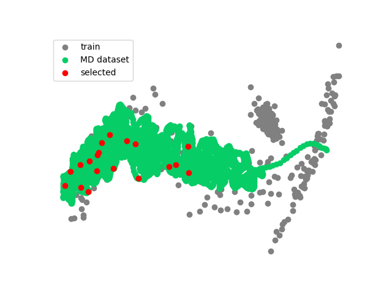
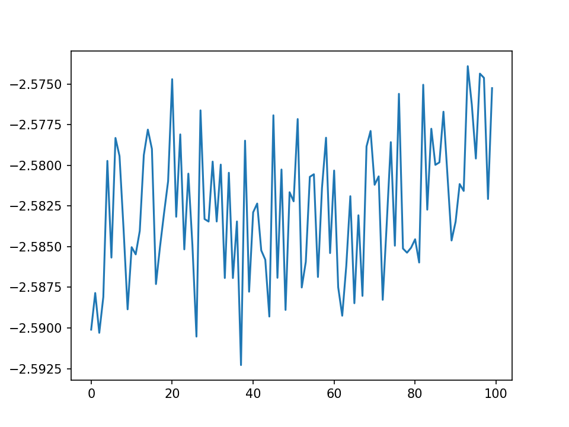

# VASPTool/GpumdTool

[Github](https://github.com/aboys-cb/VaspTool) 国内可选择 [Gitee](https://gitee.com/QMaster/VaspTool)

## 介绍

GpumdTool 主要用于GPUMD的主动学习。

### 功能特点

- 可以一次任务对多个任务、多个结构进行gpumd采样主动学习。
- 支持作业管理系统提交

# 注意事项

- 目前使用的是pynep的最远点采样 所以要每次主动学习都是上一次的train.xyz 和nep.txt

## 软件架构

建议使用 Python 3.10 以上版本。旧版本可能会报错类型错误。

## 安装教程

```bash
conda create -n mysci python=3.10
```

使用 pip 安装必需的库：

```bash
pip install calorine ase sklearn
```

将gpumd加入到~/.bashrc 程序会直接调用gpumd

### 使用教程
- 首先将nep.txt、train.xyz、GpumdTool.py 拷贝到要计算的目录 这里叫~/learn
- 在~/learn下新建个s文件夹 用于存放跑md的结构文件（\*.vasp 或者\*.xyz），如果是单个文件也可以不用建立文件夹。
- 运行结束后会在脚本目录下有一个result文件夹，里面放着抽取的结构
- 在具体的计算目录 会有两个图 一个是能量一个是选取的结构分布图
-  

- 如果是主动学习 可以使用以下命令（10ps 300k 每次md最多抽取20个结构）

  ```bash
  python GpumdTool.py learn ./s -t 10  -T 300 -max 20 --template=npt_scr
  ```
- 具体的计算细节文件在cache文件夹。抽取的结果在result
- 如果想跑100-900k 间隔50的温度区间

  ```bash
  python GpumdTool.py learn ./s -t 10  -T {100..900..50} --template=npt_scr
  ```

## run.in模板

在脚本目录下直接将run.in 改成自己想的名字 比如run 然后通过--template传入脚本即可。比如

  ```bash
  python GpumdTool.py learn ./s -t 10  -T 300 -max 20 --template=run
  ```

### 注意事项

- 程序会替换velocity ensemble 的温度部分以及run的时间
- 其他类似控制输出文件的 均由模板定义